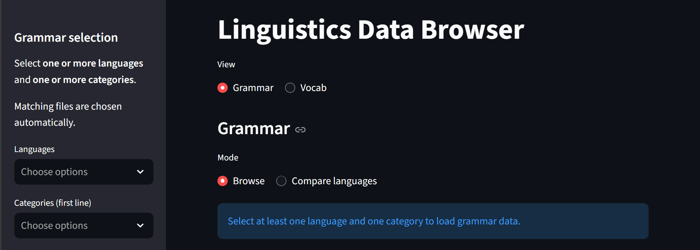
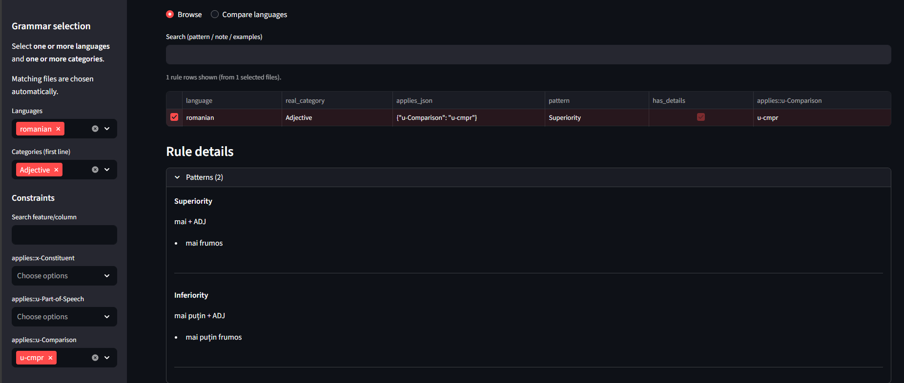
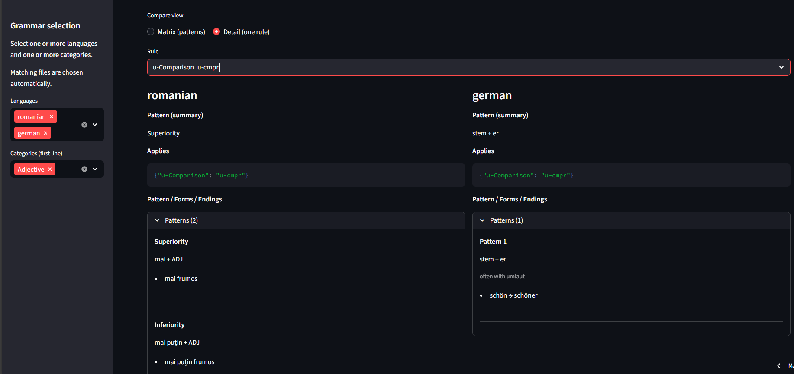
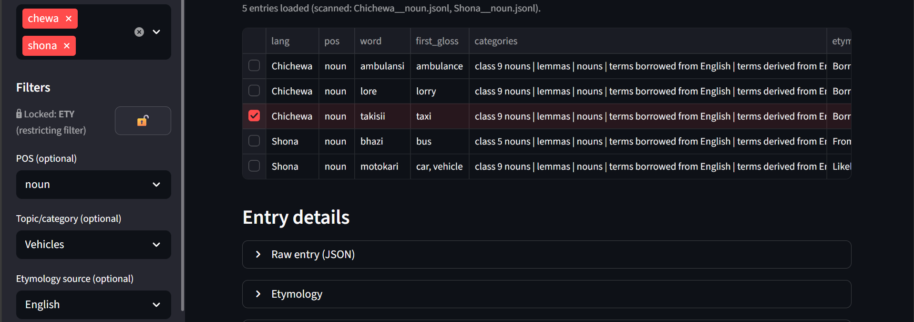

This repository's application can be found under: [Unify Language Data: Streamlit App](https://dominic-fischer-unify-language-data-app-qdypkn.streamlit.app/)

## Application Guide

The interface is split into two main parts, Grammar and Vocab, which in turn offer each a "Browsing" and a "Compare" view.

### Grammar
The grammar browsing view allows the user to input the language, the grammar topic and more fine-grained criteria to find certain grammar rules. Select a specific rule then expands it below to show all details.


The compare view is best suited to comparing two or more languages' grammar on certain topics, as illustrated by the comparative in German and Romanian.


### Vocab
Similarly, the vocab browsing view lets the user specify filters to find words of a specific part of speech and, optionally, pertaining to a given topic or derived from a certain language. Clicking a word expands it below.


Again, analogously, the vocab compare view serves to compare languages; the only difference to the grammar being that the limit here is two languages.


## Limitations
The most obvious limitation of the application is data quality:
A) The source data (Wikipedia, Wiktionary, Textbooks) might not have been above all doubts from the start, and
B) GPT-5.2 might have misinterpreted some things (despite minute prompting)

Moreover, comparing grammar across different languages and, more acutely, different language families, is not a trivial task. While big efforts were made to try and ensure exactly this compatibility, the LLM-based processing of the data introduced noise and unpredictability, resulting in the same phenomenon being annotated inconsistently across languages and sometimes even within a language.

Finally, GPT was asked to only work with the data given, in order to ensure more strict and straightforward processing of the source data and avoid hallucinations. The downside of this approach is incomplete grammar descriptions.

## Background

### What? - The Idea

The aim of this project is to synthesise existing linguistic description data into a structured format with the help of an LLM, in order to the provide an interface where users can browse and compare the two core components of language learning - grammar and vocabulary - across different languages. Currently, supported languages[^1] include the Romance languages French, Italian, Spanish, Portuguese and Romanian, the Bantu languages Chichewa (Chewa, Nyanja), Chishona (Shona), Kiswahili (Swahili), isiZulu (Zulu).

### Why? - The Motivation

Learning becomes more efficient when learners can recognize patterns, connect new information to what they already know, and evaluate similarities and differences among concepts. These processes help structure new information, support the formation of meaningful categories, and facilitate the organization of knowledge in a way that allows for prediction and generalization.

Thus, processing information about a new language can benefit from putting it into the context of already known languages to better find similarities and differences. However, traditional learning materials neglect this cross-lingual approach, focussing on the target language only. Furthermore, there is no one description of language, every article or textbook may present and structure the information differently, based on their view of the matter. This is inherently limiting, as it does not allow factoring in how a particular learner best learns.

This is why I came up with this design, that:
A) presents linguistic data in a uniform and cross-lingually compatible way
B) allows for contextualizing new linguistic information within a wider ecosystem of languages
C) facilitates flexible and dynamic display of the data according to a number of parameters

### How? - The Process

#### Data Preparation

The first step was to bring the Grammar data, sourced from textbook-like word documents[^2] as well as Wikipedia articles into a style that would allow for GPT-5.2 to efficiently process the data and bring it into the specified format. The chosen format was a markdown-style text format, the same for both Wikipedia- and Word-sourced data, illustrated down below (from [Wikipedia: Italian Grammar](https://en.wikipedia.org/wiki/Italian_grammar)):

```
    # Italian grammar

    Italian grammar is the body of rules describing the properties of the  Italian language. Italian words can be divided into the following lexical categories: articles, nouns, adjectives, pronouns, verbs, adverbs, prepositions, conjunctions, and interjections.

    ## Articles

    Italian articles vary according to definiteness (definite, indefinite, and partitive), number, gender, and the initial sound of the subsequent word. Partitive articles compound the preposition di with the corresponding definite article, to express uncertain quantity. In the plural, they typically translate into English as 'few'; in the singular, typically as 'some'.
```

For the Vocabulary data, the [Kaikki Wiktionary Archive](https://kaikki.org/) was used as is: the Wiktionary style of keeping vocabulary records was used as the Gold Standard (even if it is not entirely consistent within itself) and used for feeding the data into the interface. Future work could look into augmenting that data with external Vocabulary sources, and even tying these in with the Grammar (e.g., linking inflection patterns to the words that follow it).

The second step was then to specify a Gold Standard, interface-compatible format for the grammar, which was actually a major difficulty and needed multiple passes until a simple yet well-functioning schema could be devised. The schema can be represented as follows:

```
    Title
        Features
            FeatureName1: [value1, value2, ...]
            FeatureName2: [value1, value2, ...]

        Rules
            RuleName
                title?
                notes?
                applies
                    feature1: value
                    feature2: value
                (patterns | formparadigms | endingparadigms)+

    # This is the substructure of the three main components
    patterns               formparadigms               endingparadigms
        - pattern               - formparadigm              - endingparadigm
                                    - features                  - features  
                                    form                        form
        title?                  title?                      title?
        notes?                  notes?                      notes?
        examples?               examples?                   examples?

```

18 separate grammar categories were distinguished[^3], and for each of them a German reference schema was meticulouse devised so as to guide the LLM in the best possible manner. They can be found [here](schemas/lang-de/).


The third step consistent in [aligning the Grammar schemas with potentially relevant sections](create_mappings/) from the source data, as cluttering the prompt with irrelevant information is not conducive to good results. This matching was done by first looking for lexical matches in titles or subtitles of a given article based on a minimal set of relevant search terms. E.g., if the grammar schema is "Determiners" and we are looking for relevant content, the set of keys is {determiner, article, det, art}. As a fallback, embedding of the section text was used (with Sentence Transformer, i.e. Cosine Similarity). If the similarity value fell below, 0.5, the content was not used, lest we steer the LLM wrong.

#### Data Generation

Next, a prompt had to be devised. Inside the prompt was the following content and instructions:
- General instructions how to deal with the input data
- The validation schema in both is original JSON notation as well as in the text-based representation above
- Guidelines as to how to implement the schema
- Detailed instructions about how to use features and values in the schema
- Output-format constraints
- Specific instructions for each grammar topic
- The relevant sections from the source data
- The Gold Standard German output for the given grammar topic as a reference

GPT-5.2 was then prompted with that prompt and produced the standardised grammar description schemas. The output can be found [here](outputs_gpt-5.2/), the prompts [here](prompts/), 

#### Data Postprocessing

The generated schemas then had to be [validated and, if necessary, fixed](testing_validation/).

#### Interface Building

The [interface](app_ui/) was built with Streamlit. Relative schema simplicity was crucial so that the data could be [read and fed into the interface](app_data/) reasonably easily.

One major issue that is not yet entirely resolved is speed of the application. The wiktionary vocab JSONL files especially tend to be rather large and were included as github release assets in the repo, so that the Streamlit application can access them. However, iterating through them still takes a considerable amount of time; a faster solution remains desirable.

[^1]: Note that Grammar descriptions exist also for German. Unlike the others, these were manually done by me to serve as a Gold Standard of how these grammar descriptions schema should look like. For more information, see [here](#why---the-motivation).
[^2]: The textbooks consisted in data put together by myself over the years from various sources, especially for the lower ressource Bantu languages, that I have a personal interest in.
[^3]: Adjectives, Adverbs, Agreement, Clauses, Conditionals, Constituents, Derivation, Determiners, Future Tense, Imperative, Negation, Nouns, Passive Voice, Past Tense, Present Tense, Pronouns, Reported Speech, Subjunctive
